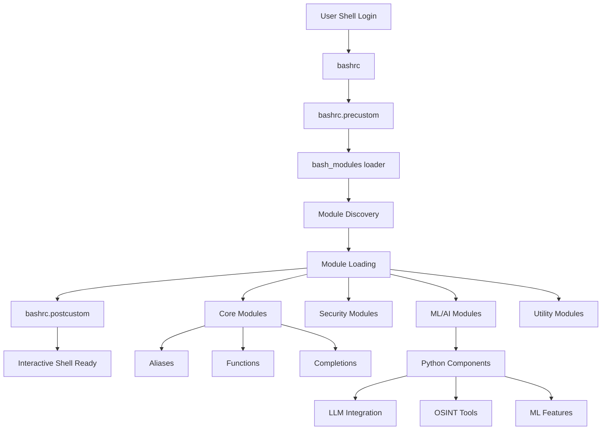

# SENTINEL Architecture Overview

SENTINEL (Secure ENhanced Terminal INtelligent Layer) is a sophisticated bash environment enhancement system designed for cybersecurity professionals and power users. This document provides a comprehensive overview of the project's architecture and how its components interact.

## Core Architecture Principles

### 1. Modular Design
SENTINEL follows a modular architecture where functionality is distributed across independent modules that can be loaded on-demand. This provides:
- Flexibility in enabling/disabling features
- Easier maintenance and updates
- Better performance by loading only needed components
- Clear separation of concerns

### 2. Layered Configuration
The system uses a layered approach to configuration:
```
bashrc (minimal core)
  ├── bashrc.precustom (pre-customization hooks)
  ├── bash_modules (module loader)
  ├── bash_modules.d/* (individual modules)
  └── bashrc.postcustom (post-customization hooks)
```

### 3. Security-First Design
- HMAC verification for critical components
- Shell security hardening
- Secure handling of sensitive operations
- Input validation and sanitization

## Component Interaction Flow



## Key Components

### 1. Bash Environment Layer

#### Core Files
- **bashrc**: Minimal core configuration that bootstraps the system
- **bashrc.precustom**: Pre-customization hooks for early initialization
- **bashrc.postcustom**: Post-customization hooks and user-specific settings
- **emergency.bashrc**: Fallback configuration for recovery scenarios

#### Module System
- **bash_modules**: Main module loader script
- **bash_modules.d/**: Directory containing individual module files
  - Each module is self-contained with its own configuration
  - Modules can declare dependencies on other modules
  - Loading order is managed by the module system

### 2. Enhancement Layers

#### Aliases System
- **bash_aliases**: Main aliases file
- **bash_aliases.d/**: Organized alias categories
  - `autocomplete.new`: Enhanced autocomplete aliases
  - `disks`: Disk management shortcuts
  - `netstat`: Network status aliases
  - `proc`: Process management aliases
  - `text_formatting`: Text manipulation aliases

#### Functions System
- **bash_functions**: Main functions file
- **bash_functions.d/**: Organized function categories
  - `findlarge`: File size analysis functions
  - `iptables_helpers`: Firewall management helpers
  - `path_manager.sh`: PATH manipulation utilities
  - `python_helpers`: Python environment helpers
  - `search`: Enhanced search capabilities
  - `venv_helpers`: Virtual environment management

#### Completion System
- **bash_completion**: Main completion configuration
- **bash_completion.d/**: Tool-specific completions
- **sentinel-completion.bash**: SENTINEL-specific completions

### 3. Intelligence Layer (Python Components)

Located in `contrib/`, these components provide advanced features:

#### Core Intelligence
- **sentinel_autolearn.py**: Adaptive learning from user behavior
- **sentinel_context.py**: Context-aware command suggestions
- **sentinel_suggest.py**: Intelligent command suggestions
- **sentinel_task_detect.py**: Automatic task detection

#### ML/AI Features
- **sentinel_chat.py**: Local LLM chat integration
- **sentinel_nlu.py**: Natural language understanding
- **sentinel_chain_predict.py**: Command chain prediction
- **sentinel_cybersec_ml.py**: Cybersecurity-focused ML features

#### OSINT Tools
- **sentinel_osint.py**: OSINT data collection
- **sentinel_gitstar.py**: GitHub repository analysis
- **sentinel_osint_tui.py**: Terminal UI for OSINT tools

### 4. GitStar Subsystem

A comprehensive repository analysis and categorization system:

#### Components
- **categories.json**: Repository categorization definitions
- **repo_data.json**: Metadata for analyzed repositories
- **readmes/**: Categorized README files from various projects
  - Organized by category (ai/, malware/, osint/, network/, etc.)
  - Over 500 analyzed repositories

#### Functionality
- Automatic repository discovery and analysis
- Category-based organization
- README vectorization for similarity analysis
- Integration with ML components for recommendations

### 5. Installation and Configuration

#### Installation System
- **install.sh**: A wrapper script that calls the main installer.
- **installer/**: A directory containing the modularized installer scripts.
  - **main.sh**: The main entry point for the installer.
  - **helpers.sh**: Helper functions for logging, file operations, etc.
  - **dependencies.sh**: Functions for checking dependencies.
  - **directories.sh**: Functions for setting up the directory structure.
  - **python.sh**: Functions for setting up the Python virtual environment.
  - **blesh.sh**: Functions for installing and configuring BLE.sh.
  - **bash.sh**: Functions for patching the user's bashrc and copying shell files.

#### Configuration Management
- **config.yaml.dist**: A template for the configuration file.
- **config.yaml**: The main configuration file for the installer and the shell environment.
- **installer/config.py**: A Python script that parses the configuration file and exports the values as environment variables.

## Data Flow

### 1. Command Execution Flow
```
User Input → Shell → Module Hooks → Command Processing → Output
                ↓                           ↓
           ML Analysis               Context Recording
                ↓                           ↓
           Suggestions               Learning Update
```

### 2. Module Loading Flow
```
bash_modules → Discover Modules → Check Dependencies → Load in Order
                     ↓                    ↓                  ↓
              Parse Metadata      Resolve Conflicts    Execute Init
```

### 3. ML/AI Processing Flow
```
Command History → Feature Extraction → Model Inference → Suggestions
                        ↓                    ↓              ↓
                 Context Analysis      Pattern Match    User Feedback
```

## Security Architecture

### 1. Module Security
- HMAC verification for critical modules
- Signature checking for module integrity
- Sandboxed execution environment

### 2. Data Security
- Encrypted storage for sensitive data
- Secure handling of credentials
- Audit logging for security events

### 3. Network Security
- Secure communication protocols
- Input validation for network operations
- Rate limiting and abuse prevention

## Performance Optimizations

### 1. Lazy Loading
- Modules loaded only when needed
- Deferred initialization for heavy components
- On-demand Python component activation

### 2. Caching
- Configuration caching
- Command history optimization
- Precomputed suggestions

### 3. Parallel Processing
- Concurrent module loading where possible
- Asynchronous ML processing
- Background task execution

## Extensibility

### 1. Module Development
- Clear module API
- Template module (skeleton.module)
- Module manager for easy integration

### 2. Python Extensions
- Plugin architecture for Python components
- Standard interfaces for ML models
- Easy integration with external tools

### 3. Custom Configurations
- User-specific overrides
- Project-specific settings
- Environment-based configurations

## Future Architecture Plans

1. **Distributed Components**: Support for distributed SENTINEL instances
2. **Cloud Integration**: Optional cloud-based ML processing
3. **Plugin Marketplace**: Community module repository
4. **API Gateway**: RESTful API for external integrations
5. **Container Support**: Docker/Kubernetes deployment options

## Testing

SENTINEL uses a combination of unit tests and integration tests to ensure the quality of the code.

### Unit Tests
Unit tests for Python scripts are located in the `tests/` directory and are written using the `unittest` module.

### Integration Tests
Integration tests for the installer and the shell environment are located in the `tests/` directory and are written using the `bats-core` testing framework.

## Conclusion

SENTINEL's architecture provides a robust, secure, and extensible framework for terminal enhancement. The modular design allows users to customize their experience while maintaining system stability and security. The integration of ML/AI components provides intelligent assistance without compromising privacy or performance.