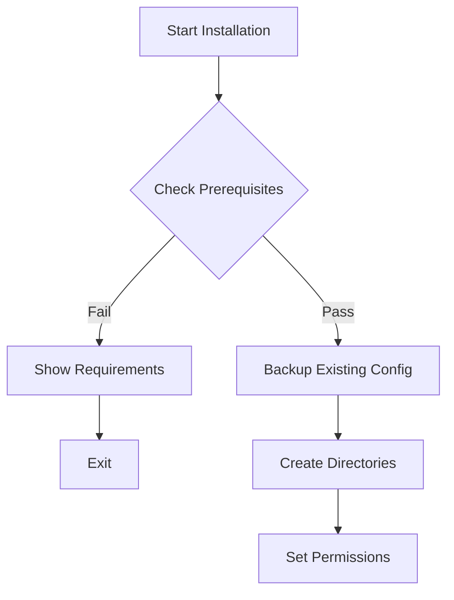
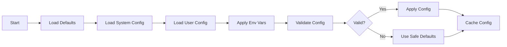

# SENTINEL Installation and Configuration Flow

## Overview

This document details the complete installation process, configuration management, and initialization flow of SENTINEL. Understanding this flow is crucial for troubleshooting, customization, and development.

## Installation Process

### 1. Pre-Installation Phase



#### Prerequisites Check
The installer (`install.sh`) verifies:
- Bash version (≥ 4.4)
- Required commands (git, python3, pip)
- System architecture
- Available disk space
- User permissions

#### Backup Process
```bash
# Backs up existing configurations
~/.bashrc → ~/.bashrc.sentinel.backup
~/.bash_aliases → ~/.bash_aliases.sentinel.backup
~/.bash_functions → ~/.bash_functions.sentinel.backup
```

### 2. Core Installation Phase

#### Directory Structure Creation
```bash
$SENTINEL_BASE_PATH/
├── bash_modules.d/      # Module directory
├── bash_aliases.d/      # Alias collections
├── bash_functions.d/    # Function collections
├── bash_completion.d/   # Completion scripts
├── contrib/             # Python components
├── config/              # Configuration files
├── logs/                # Log directory
└── cache/               # Cache directory
```

#### File Deployment
```bash
# Core files
install.sh copies:
- bashrc → ~/.bashrc (or integrates with existing)
- bash_modules → $SENTINEL_BASE_PATH/
- bash_modules.d/* → $SENTINEL_BASE_PATH/bash_modules.d/
- contrib/* → $SENTINEL_BASE_PATH/contrib/
```

### 3. Module Installation Phase

#### Module Discovery and Validation
```bash
for module in $SENTINEL_BASE_PATH/bash_modules.d/*.module; do
    # Validate module header
    validate_module_header "$module"
    
    # Check dependencies
    check_module_dependencies "$module"
    
    # Register module
    register_module "$module"
done
```

#### Dependency Resolution
```
Module A depends on → Module B depends on → Core Module
    ↓                      ↓                     ↓
Load Order: Core Module → Module B → Module A
```

### 4. Python Environment Setup

#### Virtual Environment Creation
```bash
# Create isolated Python environment
python3 -m venv $SENTINEL_BASE_PATH/venv

# Activate and install dependencies
source $SENTINEL_BASE_PATH/venv/bin/activate
pip install -r requirements.txt
```

#### Python Component Verification
```python
# Test each Python component
for component in contrib/sentinel_*.py:
    python -m pytest tests/test_${component}
```

### 5. Configuration Phase

#### Configuration Hierarchy
```
1. Default Configuration (built-in)
    ↓
2. System Configuration (/etc/sentinel/)
    ↓
3. User Configuration (~/.sentinel/)
    ↓
4. Environment Variables
    ↓
5. Runtime Overrides
```

#### Initial Configuration
```bash
# Generate default configuration
cat > ~/.sentinel/config.yaml << EOF
sentinel:
  version: $(get_version)
  features:
    ml_enabled: true
    chat_enabled: false
    osint_enabled: true
  paths:
    base: $SENTINEL_BASE_PATH
    cache: $HOME/.cache/sentinel
    logs: $HOME/.local/share/sentinel/logs
EOF
```

### 6. Integration Phase

#### Bashrc Integration
```bash
# Add to ~/.bashrc
if [ -f "$SENTINEL_BASE_PATH/bashrc" ]; then
    source "$SENTINEL_BASE_PATH/bashrc"
fi
```

#### Shell Detection and Adaptation
```bash
# Detect shell type
case "$SHELL" in
    */bash)
        configure_for_bash
        ;;
    */zsh)
        configure_for_zsh
        ;;
    *)
        show_manual_configuration
        ;;
esac
```

### 7. Post-Installation Phase

#### Verification Steps
1. **Module Loading Test**
   ```bash
   source ~/.bashrc
   sentinel module list
   ```

2. **Component Health Check**
   ```bash
   sentinel_postinstall_check.sh
   ```

3. **Feature Verification**
   ```bash
   # Test key features
   sentinel test ml
   sentinel test chat
   sentinel test osint
   ```

## Configuration Management

### Configuration Sources

#### 1. Built-in Defaults
Located in module files and Python components:
```bash
# In modules
DEFAULT_TIMEOUT=${SENTINEL_TIMEOUT:-30}
DEFAULT_CACHE_SIZE=${SENTINEL_CACHE_SIZE:-1000}
```

#### 2. Configuration Files

**Global Configuration** (`/etc/sentinel/config.yaml`):
```yaml
sentinel:
  system:
    max_memory: 2G
    max_cpu: 50%
  security:
    audit_level: standard
    encryption: enabled
```

**User Configuration** (`~/.sentinel/config.yaml`):
```yaml
sentinel:
  preferences:
    theme: dark
    suggestions: true
  modules:
    enabled:
      - core
      - ml
      - security
    disabled:
      - experimental
```

#### 3. Environment Variables
```bash
# Core settings
export SENTINEL_BASE_PATH="/opt/sentinel"
export SENTINEL_DEBUG="false"
export SENTINEL_LOG_LEVEL="info"

# Feature flags
export SENTINEL_ML_ENABLED="true"
export SENTINEL_CHAT_MODEL="llama2"
export SENTINEL_OSINT_SOURCES="github,shodan"

# Performance tuning
export SENTINEL_CACHE_SIZE="1000"
export SENTINEL_PARALLEL_JOBS="4"
```

### Configuration Loading Flow



### Dynamic Configuration Updates

```bash
# Runtime configuration changes
sentinel config set ml.enabled true
sentinel config set chat.model "mistral"

# Reload configuration
sentinel reload

# View current configuration
sentinel config show
```

## Initialization Flow

### 1. Shell Startup Sequence

```
Shell Start
    ↓
.bashrc sourced
    ↓
SENTINEL bashrc sourced
    ↓
bashrc.precustom executed
    ↓
Module system initialized
    ↓
Modules loaded (in dependency order)
    ↓
bashrc.postcustom executed
    ↓
Shell ready
```

### 2. Module Loading Sequence

```bash
# 1. Initialize module system
source $SENTINEL_BASE_PATH/bash_modules

# 2. Discover available modules
MODULES=$(find $SENTINEL_BASE_PATH/bash_modules.d -name "*.module")

# 3. Parse module metadata
for module in $MODULES; do
    parse_module_header "$module"
done

# 4. Build dependency graph
build_dependency_graph

# 5. Determine load order
LOAD_ORDER=$(topological_sort $DEPENDENCY_GRAPH)

# 6. Load modules
for module in $LOAD_ORDER; do
    source "$module"
    ${module}_init  # Call module init function
done
```

### 3. Python Component Initialization

```python
# Lazy loading of Python components
def init_python_component(component_name):
    # Check if already loaded
    if component_name in LOADED_COMPONENTS:
        return LOADED_COMPONENTS[component_name]
    
    # Import component
    module = importlib.import_module(f"sentinel_{component_name}")
    
    # Initialize
    component = module.init()
    
    # Cache
    LOADED_COMPONENTS[component_name] = component
    
    return component
```

### 4. Cache Warming

```bash
# Pre-populate caches for better performance
warm_caches() {
    # Command history cache
    cache_recent_commands
    
    # Configuration cache
    cache_configuration
    
    # ML model cache
    preload_ml_models
    
    # Completion cache
    build_completion_cache
}
```

## Uninstallation Process

### 1. Pre-Uninstall Phase
```bash
# Save user data
backup_user_data() {
    tar -czf ~/sentinel_backup_$(date +%Y%m%d).tar.gz \
        ~/.sentinel/config.yaml \
        ~/.sentinel/data/ \
        ~/.sentinel/logs/
}
```

### 2. Component Removal
```bash
# Remove in reverse order
1. Deactivate Python environment
2. Unload modules
3. Remove shell integrations
4. Delete files
5. Clean environment variables
```

### 3. Restoration
```bash
# Restore original files
restore_original_configs() {
    mv ~/.bashrc.sentinel.backup ~/.bashrc
    mv ~/.bash_aliases.sentinel.backup ~/.bash_aliases
    # ... etc
}
```

## Troubleshooting Installation

### Common Issues

#### 1. Module Loading Failures
```bash
# Debug module loading
export SENTINEL_MODULE_DEBUG=1
source ~/.bashrc

# Check specific module
bash -x $SENTINEL_BASE_PATH/bash_modules.d/problematic.module
```

#### 2. Python Component Issues
```bash
# Verify Python environment
source $SENTINEL_BASE_PATH/venv/bin/activate
python --version
pip list

# Test component directly
python $SENTINEL_BASE_PATH/contrib/sentinel_component.py --test
```

#### 3. Configuration Problems
```bash
# Validate configuration
sentinel config validate

# Reset to defaults
sentinel config reset

# Show configuration sources
sentinel config sources
```

### Installation Logs

```bash
# Installation log locations
/tmp/sentinel_install.log      # Main installation log
~/.sentinel/logs/modules.log   # Module loading log
~/.sentinel/logs/config.log    # Configuration log
```

### Recovery Mode

```bash
# Start with minimal configuration
bash --rcfile $SENTINEL_BASE_PATH/emergency.bashrc

# Diagnose issues
sentinel diagnose

# Repair installation
sentinel repair
```

## Best Practices

### 1. Custom Configurations
- Keep customizations in `bashrc.postcustom`
- Use environment variables for temporary changes
- Document all customizations

### 2. Module Development
- Test modules in isolation first
- Declare all dependencies
- Provide fallback behavior

### 3. Updates and Upgrades
- Always backup before updating
- Test updates in a separate environment
- Review changelog for breaking changes

## Conclusion

Understanding the SENTINEL installation and configuration flow enables:
- Efficient troubleshooting
- Custom deployments
- Module development
- System optimization

The modular architecture and clear initialization sequence make SENTINEL both powerful and maintainable.